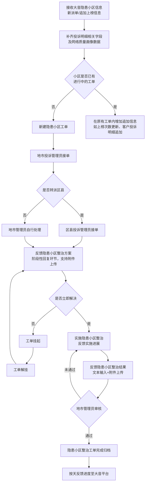

# TOP投诉小区隐患整治系统 - 产品需求文档 (PRD)

## 1. 产品概述

TOP投诉小区隐患整治系统是一个面向家宽运维支撑系统的工单管理模块，实现大音平台TOP投诉小区隐患工单的全流程线上化闭环管理。系统支持两类账号（地市管理员、区县管理员），覆盖从数据同步、工单接收、方案制定、实施、审核到归档的完整生命周期，并支持进度反馈、历史追踪及数据导出功能。

## 2. 核心功能

### 2.1 用户角色

| 角色    | 登录方式   | 核心权限                            |
| ----- | ------ | ------------------------------- |
| 地市管理员 | 系统账号登录 | 接单、派单/转派、方案制定、实施反馈、审核、归档、查看全部工单 |
| 区县管理员 | 系统账号登录 | 接单、方案制定、实施反馈、查看本区县工单            |

### 2.2 功能模块

1. **登录模块**：角色选择登录，区分地市管理员和区县管理员
2. **首页仪表盘**：统计看板（待接单数、实施中数、审核中数、已归档数、工单挂起数）
3. **隐患工单管理**：工单列表、接单、派单、方案制定、实施反馈、挂起/解挂、审核、归档
4. **投诉工单明细**：关联投诉工单列表展示与导出
5. **数据导出**：隐患工单导出、投诉工单明细导出（Excel）
6. **历史进展追踪**：各环节操作记录自动拼接展示

### 2.3 页面详情

| 页面名称   | 模块名称   | 功能描述                       |
| ------ | ------ | -------------------------- |
| 登录页    | 角色选择登录 | 选择地市管理员或区县管理员身份登录          |
| 首页仪表盘  | 统计卡片   | 展示各类工单状态数量统计               |
| 首页仪表盘  | 待办提醒   | 展示当前用户待处理工单                |
| 隐患工单列表 | 筛选查询   | 按环节、地市、区县、时间段、工单号、小区名称筛选   |
| 隐患工单列表 | 工单表格   | 展示隐患工单基本信息及当前状态            |
| 隐患工单详情 | 工单信息   | 展示大音平台派单信息及系统补全信息          |
| 隐患工单详情 | 流程操作   | 根据当前状态显示可执行操作按钮            |
| 隐患工单详情 | 历史进展   | 展示各环节操作记录时间线               |
| 隐患工单详情 | 投诉明细   | 展示关联的投诉工单列表                |
| 投诉工单明细 | 列表展示   | 展示所有投诉工单明细及验真、户内网信息        |
| 投诉工单明细 | 筛选导出   | 按地市、区县、时间段、聚类工单编号、小区名称筛选导出 |

## 3. 核心流程

### 3.1 隐患工单全流程

### 3.2 状态流转

| 当前状态 | 可执行操作   | 下一状态     |
| ---- | ------- | -------- |
| 待接单  | 接单      | 方案制定     |
| 方案制定 | 提交方案/挂起 | 实施中/工单挂起 |
| 工单挂起 | 解挂      | 方案制定     |
| 实施中  | 提交实施结果  | 审核中      |
| 审核中  | 通过/退回   | 已归档/实施中  |
| 已归档  | -       | -        |

## 4. 用户界面设计

### 4.1 设计风格

* **主色调**：深蓝色 (#1e3a5f) 作为品牌主色，体现专业、稳重的运维系统风格

* **辅助色**：青色 (#0ea5e9) 用于高亮和交互状态，琥珀色 (#f59e0b) 用于警告/待办

* **背景色**：浅灰蓝 (#f1f5f9) 作为页面背景，白色卡片内容区

* **按钮样式**：圆角矩形（radius: 6px），主按钮使用主色调，危险操作用红色

* **字体**：系统默认字体栈，标题加粗，正文常规

* **布局**：顶部导航栏 + 左侧菜单 + 右侧内容区，卡片式信息展示

* **图标**：使用 lucide-react 图标库

### 4.2 页面设计概述

| 页面名称   | 模块名称 | UI元素                              |
| ------ | ---- | --------------------------------- |
| 登录页    | 登录表单 | 居中卡片，角色选择标签页，账号密码输入框，登录按钮         |
| 仪表盘    | 统计卡片 | 5个统计卡片横向排列，数字大字体展示，图标+标题+数字       |
| 仪表盘    | 待办列表 | 表格展示待处理工单，突出显示紧急工单                |
| 隐患工单列表 | 筛选区  | 下拉选择框、日期范围选择器、输入框、查询/重置按钮         |
| 隐患工单列表 | 表格区  | 分页表格，操作列包含查看/处理按钮，状态标签带颜色         |
| 隐患工单详情 | 信息区  | 分组卡片展示工单基本信息、大音平台信息、系统补全信息        |
| 隐患工单详情 | 操作区  | 根据状态动态显示操作按钮（接单/派单/方案制定/实施/审核/归档） |
| 隐患工单详情 | 时间线  | 垂直时间线展示历史进展记录                     |
| 投诉工单明细 | 列表区  | 宽表格展示投诉工单、验真信息、户内网画像              |

### 4.3 响应式设计

* 桌面端优先设计（最小宽度 1280px）

* 表格区域支持横向滚动

* 统计卡片在较小屏幕下自动换行

## 5. 数据模型

### 5.1 隐患工单主表

| 字段名                | 类型       | 说明     |
| ------------------ | -------- | ------ |
| id                 | string   | 工单唯一标识 |
| cluster\_order\_no | string   | 聚类工单编号 |
| city               | string   | 地市     |
| county             | string   | 区县     |
| cell\_code         | string   | 小区编码   |
| cell\_name         | string   | 小区名称   |
| complaint\_count   | number   | 投诉次数   |
| status             | enum     | 工单状态   |
| current\_handler   | string   | 当前处理人  |
| handler\_role      | enum     | 处理人角色  |
| receive\_time      | datetime | 接单时间   |
| plan\_time         | datetime | 方案制定时间 |
| implement\_time    | datetime | 实施时间   |
| archive\_time      | datetime | 归档时间   |
| latest\_progress   | text     | 最新处理情况 |
| history\_progress  | text     | 历史进展拼接 |
| hang\_reason       | string   | 挂起原因   |
| hang\_time         | datetime | 挂起时间   |
| archive\_result    | text     | 归档整治结果 |

### 5.2 投诉工单明细表

| 字段名                  | 类型       | 说明         |
| -------------------- | -------- | ---------- |
| id                   | string   | 明细ID       |
| cluster\_order\_id   | string   | 关联隐患工单ID   |
| sheet\_id            | string   | 流水号        |
| bandwidth            | string   | 带宽         |
| acc\_nbr\_209        | string   | 家宽209号码    |
| customer\_tag        | string   | 客户标签       |
| archive\_user        | string   | 归档人姓名      |
| install\_user\_id    | string   | 装维账号ID     |
| install\_company     | string   | 装维人员公司     |
| accept\_time         | datetime | 投诉时间       |
| back\_date           | datetime | 归档时间       |
| customer\_city       | string   | 客户归属地      |
| contact\_address     | string   | 故障地点       |
| direct\_code         | string   | 小区编码       |
| cell\_name           | string   | 小区名称       |
| zyfgczw              | string   | 小区归属区域     |
| state\_name          | string   | 工单状态       |
| terr\_name           | string   | 所属班组       |
| obstacle\_appearance | text     | 投诉内容       |
| end\_type            | string   | 投诉本地分类     |
| deal\_type\_type0    | string   | 故障原因一级分类   |
| deal\_type\_type2    | string   | 故障原因二级分类   |
| deal\_type\_type3    | string   | 人工填写三级原因分类 |

### 5.3 验真工单信息表

| 字段名              | 类型       | 说明        |
| ---------------- | -------- | --------- |
| id               | string   | ID        |
| complaint\_id    | string   | 关联投诉工单ID  |
| sheet\_id        | string   | 流水号       |
| city\_name       | string   | 地市        |
| county\_name     | string   | 区县        |
| qpa\_user\_name  | string   | 稽核人员姓名    |
| qpa\_user\_id    | string   | 稽核人员账号    |
| qpa\_time        | datetime | 稽核时间      |
| gd\_bj\_reason1  | string   | 归档报结一级原因  |
| gd\_bj\_reason2  | string   | 归档报结二级原因  |
| gd\_bj\_reason3  | string   | 归档报结三级原因  |
| gd\_bj\_reason4  | text     | 归档备注      |
| qpa\_bj\_reason1 | string   | 稽核的报结一级原因 |
| qpa\_bj\_reason2 | string   | 稽核的报结二级原因 |
| qpa\_bj\_reason3 | string   | 稽核的报结三级原因 |
| qpa\_bj\_reason4 | text     | 稽核的报结手填原因 |
| qpa\_result      | string   | 稽核结果      |

### 5.4 户内网信息表

| 字段名                        | 类型     | 说明         |
| -------------------------- | ------ | ---------- |
| id                         | string | ID         |
| complaint\_id              | string | 关联投诉工单ID   |
| acc\_nbr                   | string | 209账号      |
| cust\_tag                  | string | 重要客户标识     |
| band\_width                | number | 客户带宽(Mbps) |
| lag\_conclusion\_today     | string | 当日卡慢评估     |
| phy\_quality\_today        | string | 当日物理质量评估   |
| abnormal\_parameter\_today | text   | 当日物理异常参数   |
| optical\_power             | string | 光功率(dBm)   |
| ber                        | string | 接入误码超限率    |

## 6. 导出规则

### 6.1 隐患工单导出字段

导出内容包含三部分：

1. 大音平台派单的工单基本信息
2. 家客运维支撑系统内部的环节处理信息

导出规则：

* 各环节时间（接单时间、方案制定时间、实施时间、归档时间）单独列出

* 导出表中不包含电话号码，仅保留当前状态责任人姓名

* 当前历时计算：未归档工单为"当前时间减接单时间"，已归档工单为"归档时间减接单时间"

### 6.2 投诉工单明细导出字段

包含投诉工单信息、验真工单信息、户内网画像信息的完整字段。

## 7. 高故障原因分类

下拉框选项：

* 单一网络故障高小区

* 单一户内质差聚类高投诉小区

* 单一客户侧使用问题聚类高投诉小区

* 高校等特殊高投小区

* 复合型高投诉小区

* 其他（请补充说明）

