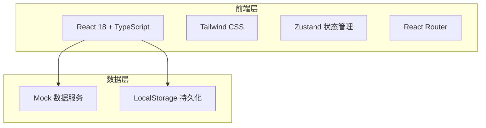

# TOP投诉小区隐患整治系统 - 技术架构文档

## 1. 架构设计



## 2. 技术选型

- **前端框架**：React 18 + TypeScript
- **构建工具**：Vite
- **样式方案**：Tailwind CSS
- **状态管理**：Zustand
- **路由**：React Router DOM
- **图标**：lucide-react
- **数据**：Mock 数据（前端模拟）

## 3. 路由定义

| 路由 | 用途 | 权限 |
|------|------|------|
| /login | 登录页 | 公开 |
| /dashboard | 首页仪表盘 | 已登录 |
| /orders | 隐患工单列表 | 已登录 |
| /orders/:id | 隐患工单详情 | 已登录 |
| /complaints | 投诉工单明细 | 已登录 |

## 4. 项目结构

```
src/
  ├── components/          # 公共组件
  │   ├── Layout.tsx       # 布局组件
  │   ├── Sidebar.tsx      # 侧边栏
  │   ├── Header.tsx       # 顶部导航
  │   ├── StatCard.tsx     # 统计卡片
  │   ├── OrderTable.tsx   # 工单表格
  │   ├── OrderFilter.tsx  # 筛选组件
  │   ├── Timeline.tsx     # 时间线组件
  │   └── ExportButton.tsx # 导出按钮
  ├── pages/               # 页面
  │   ├── Login.tsx        # 登录页
  │   ├── Dashboard.tsx    # 仪表盘
  │   ├── OrderList.tsx    # 隐患工单列表
  │   ├── OrderDetail.tsx  # 隐患工单详情
  │   └── ComplaintList.tsx# 投诉工单明细
  ├── stores/              # 状态管理
  │   ├── authStore.ts     # 认证状态
  │   └── orderStore.ts    # 工单状态
  ├── data/                # Mock数据
  │   ├── mockOrders.ts    # 隐患工单数据
  │   ├── mockComplaints.ts# 投诉工单数据
  │   └── mockUsers.ts     # 用户数据
  ├── types/               # 类型定义
  │   └── index.ts         # 所有类型
  ├── utils/               # 工具函数
  │   └── helpers.ts       # 辅助函数
  ├── App.tsx              # 根组件
  └── main.tsx             # 入口
```

## 5. 核心类型定义

```typescript
// 用户角色
enum UserRole {
  CITY_ADMIN = 'city_admin',
  COUNTY_ADMIN = 'county_admin'
}

// 工单状态
enum OrderStatus {
  PENDING = 'pending',           // 待接单
  PLANNING = 'planning',         // 方案制定
  HANGING = 'hanging',           // 工单挂起
  IMPLEMENTING = 'implementing', // 实施中
  AUDITING = 'auditing',         // 审核中
  ARCHIVED = 'archived'          // 已归档
}

// 隐患工单
interface HiddenOrder {
  id: string;
  clusterOrderNo: string;
  city: string;
  county: string;
  cellCode: string;
  cellName: string;
  complaintCount: number;
  status: OrderStatus;
  currentHandler: string;
  handlerRole: UserRole;
  receiveTime: string;
  planTime?: string;
  implementTime?: string;
  archiveTime?: string;
  latestProgress: string;
  historyProgress: string[];
  hangReason?: string;
  hangTime?: string;
  archiveResult?: string;
  highFaultReason?: string;
  attachments: string[];
}

// 投诉工单明细
interface ComplaintDetail {
  id: string;
  clusterOrderId: string;
  sheetId: string;
  bandwidth: string;
  accNbr209: string;
  customerTag: string;
  archiveUser: string;
  installUserId: string;
  installCompany: string;
  acceptTime: string;
  backDate: string;
  customerCity: string;
  contactAddress: string;
  directCode: string;
  cellName: string;
  zyfgczw: string;
  stateName: string;
  terrName: string;
  obstacleAppearance: string;
  endType: string;
  dealTypeType0: string;
  dealTypeType2: string;
  dealTypeType3: string;
  // 验真信息
  verifyInfo?: VerifyInfo;
  // 户内网信息
  homeNetInfo?: HomeNetInfo;
}
```

## 6. 状态管理设计

### 6.1 认证状态 (authStore)
- currentUser: 当前登录用户
- role: 当前角色
- login: 登录方法
- logout: 登出方法

### 6.2 工单状态 (orderStore)
- orders: 隐患工单列表
- complaints: 投诉工单列表
- currentOrder: 当前查看的工单
- filters: 筛选条件
- pagination: 分页信息
- 各种操作方法（接单、派单、更新状态等）
